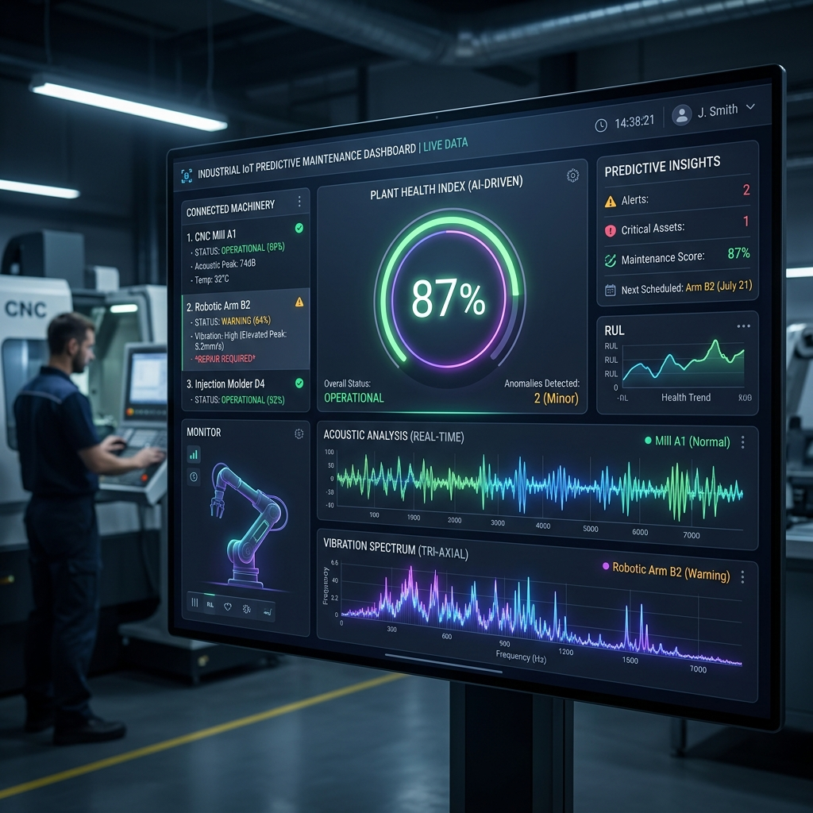

# EdgeSense AI 🏭⚡



**Real-Time Predictive Maintenance using Multi-Modal Intelligence. Hackathon Edition 2026.**

EdgeSense AI is a complete, end-to-end hardware-to-UI machine learning platform designed to predict industrial machine failure *before* it happens. By simultaneously monitoring acoustic telemetry and 3-axis vibration metrics directly from the edge, this system streams multi-modal intelligence to a high-performance visual dashboard via WebSockets.

---

## 🌟 Key Features

*   **Multi-Modal ML Intelligence:** Combines an Acoustic CNN with a Vibration LSTM to generate highly-confident predictive maintenance scores and isolate anomalous machinery behavior.
*   **Real-time Telemetry Dashboard:** A stunning, ultra-modern Next.js application that renders real-time streaming signals at sub-10ms latency using Live WebSockets.
*   **Actionable Alerts & CSV Export:** Generates critical fault warnings mapped to specific bearing/motor defects and allows an instant snapshot export of fleet health via CSV.
*   **Dockerized Deployment:** The entire production stack (FastAPI Backend + Next.js Frontend) spins up completely configured with exactly one command.
*   **Custom Training Pipeline:** Want to monitor your own machines? A full end-to-end Python pipeline is included to normalize, train, and export PyTorch models into highly-performant ONNX artifacts.

---

## 📂 Codebase Architecture

The project is decoupled into clear, standalone domains:

*   **`/next_frontend`** — A React + Next.js 14 (+ Tailwind CSS / Framer Motion) futuristic visualization dashboard.
*   **`/backend`** — A FastAPI Python server handling WebSocket streams, ONNX inference, anomaly isolation, and an SQLite database for history.
*   **`/train`** — ML Pipeline. Includes the data preparation scripts and the PyTorch scripts to train our CNN & LSTM models on physical CWRU data.
*   **`/firmware`** — Embedded C++ (PlatformIO) code destined for ESP32 / Arduino devices attached directly to factory sensors.

---

## 🚀 How to Run (Quick Start)

The easiest way to run the entire backend + frontend simultaneously is via Docker.

### Pre-requisites
*   [Docker Desktop](https://www.docker.com/products/docker-desktop/) installed and running.

### 1. Launch with Docker
Open a terminal in the root directory (`edgesense-ai`) and run:
```bash
docker-compose up --build
```

### 2. View the Dashboard
Once the containers spin up:
1. Open your browser and navigate to **[http://localhost:3000](http://localhost:3000)**.
2. The UI will instantly establish a WebSocket connection and you will see the real-time wave telemetry and health gauges animating!

---

## 🔧 Manual Setup (Without Docker)

If you'd prefer to hack on the project locally without containers:

### Start the Backend (FastAPI)
```bash
cd backend
python -m venv venv
# Windows: venv\Scripts\activate | Mac/Linux: source venv/bin/activate
pip install -r requirements.txt
uvicorn app.main:app --reload
```
*(The backend runs on `http://127.0.0.1:8000`)*

### Start the Frontend (Next.js)
In a secondary terminal tab:
```bash
cd next_frontend
npm install
npm run dev
```
*(The frontend runs on `http://localhost:3000`)*

---

## 🧠 Training Your Own Models

If you gather raw acoustic/vibration signals from *your* custom hardware, you can re-train the models included in this repo!

1. Place your raw matrices or `.npz` files inside `train/data/`.
2. Run the master PowerShell script from the root project directory:
   ```powershell
   ./run_training.ps1
   ```
3. The script will automatically parse data, train the CNN on acoustic sequences, train the LSTM on vibration profiles, bundle them into `.onnx` architectures, and verify they load cleanly into the FastAPI server.

--- 

*Happy Hacking! Let's eliminate unplanned downtime forever.*
